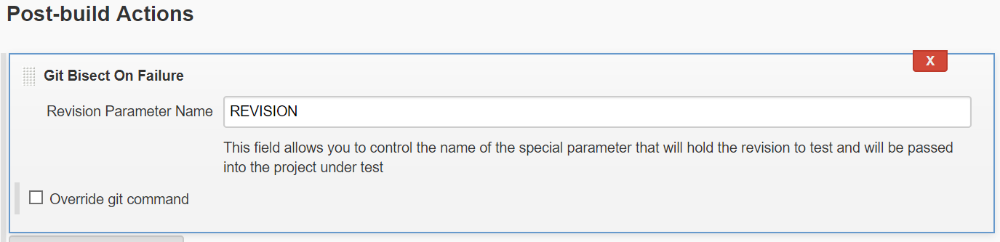

# Jenkins Git Bisect Plugin 

Git bisect is a tool for running binary searches over a git repository. If you want to read more about git bisect, you can [do it here](https://git-scm.com/docs/git-bisect).

This plugin helps with running git-bisect automatically in Jenkins.

## Table Of Contents

- Table Of Contents
    - [Pre-Requirements](#Pre-Requirements)
    - How to use this plugin
        - [Nightly Polling Jobs](#Nightly-Polling-Jobs)
        - [Manual Bisections](#Manual-Bisections)
- [Example Configuration](#Example-Configuration)
    - [Bisect Project](#Bisect-Project)
    - [Tester Project](#Tester-Project)
- [Parameters](#Parameters)
- [Running in a pipeline](#Running-in-a-pipeline)


## Pre-Requirements

You need to:

-   Be able to determine for each commit whether it's broken or not - in a **single jenkins** job
    -   If your build is separated to two projects - build & test, you can use a pipeline and use that pipeline as a single build
-   Use Git SCM, or be able to run arbitrary git commands in the workspace

## How to use this plugin

There are two modes for running the plugin:

### Nightly Polling Jobs



This is useful for nightly build failures. The plugin can help you find the specific commit that broke the build since the last time it ran. To use it you an add a post-build action to your build. You will also need to configure the git branch specifier to use a parameter.


### Manual Bisections

This is a more customizable variation of the plugin that allows you to run a long-running bisection process; 

It is meant to be used for cases where a bug was introduced sometime ago; You know how to test, and you know atleast one good revision where the bug did not exist. This variation of the plugin is also aimed to fit long builds that might be unstable or to find bugs that reproduce in an inconsistent manner.

To set it up, you need to have 2 Projects, one is for testing the bug (**"Tester Project")** and the other is for running the bisection (**"Bisect Project"**)

[TABLE]

## Example Configuration

### Bisect Project


 

### Tester Project


## Parameters

### Good start revision: 

Used to specify a known good commit where the thing you are testing was working properly. 

### Bad end revision: 

Used to specify a revision where you know the thing you are testing stopped working.

### Project to build: 

The project that is used to test each commit. If this project fails, the revision will be marked as "bad". If this project succeeds, the revision will be marked "good".

### Revision Parameter Name: 

The parameter name used to pass the revision to the Tester Project. Defaults to "REVISION", other common usage might be "COMMIT" or "VERSION". 

### Search Identifier:

This parameter is used to distinguish between two different bisections. If the bisection stopped it can be resumed based on this identifier.  

**Note:**  This is used as a file name inside the jenkins master. You can interfere with the decisions this job makes, or add revisions to ignore by editing this file. It can be found under the project directory in jenkins, for example - 

``` syntaxhighlighter-pre
/var/jenkins/jobs/PROJECT_NAME/SEARCH_IDENTIFIER_1
```

### Retry Number:

This parameter can be used if you have a flaky test or a flaky build system. The revision won't be defined as 'bad' until it had failed this number of times. (Defaults to 0)

### Min Successful runs:

This parameter can be used if you are looking for a flaky test. For example, you are looking for a commit that causes your build to fail 1 out of 5 times. So you want to increase this number accordingly. (Defaults to 1)

### Run as a single continues build

If this is unchecked, the test job will only run once every build. This gives you time to investigate between each run. (Defaults to true)

### Override Git Command

On some systems, git might not be defined in PATH or it's aliased to a different command. You can tell the job where to find it.

## Running in a pipeline

Running in a pipeline currently works, but it's harder to configure.

Make sure that before the gitbisect command is used, a "checkout" or "git" command is present to set the repository.